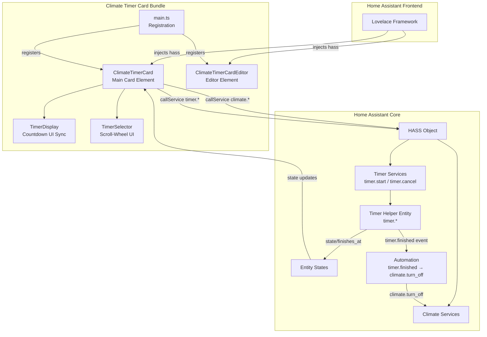
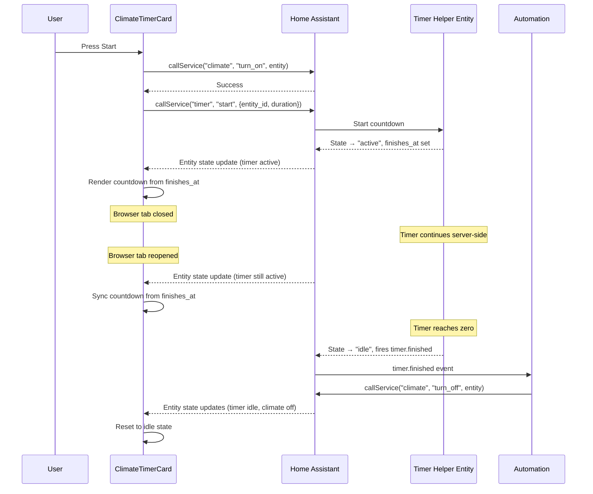
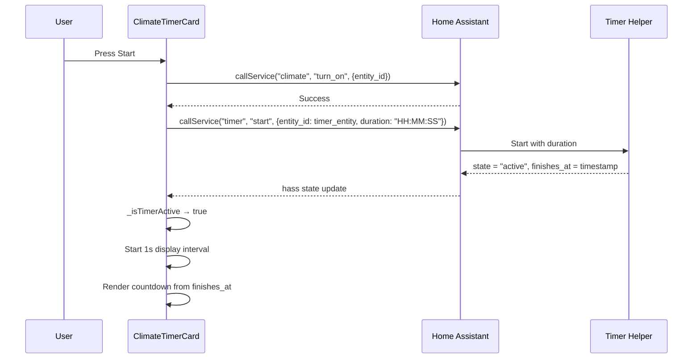
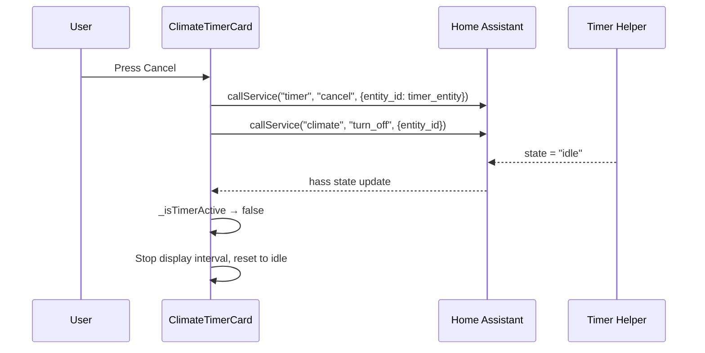
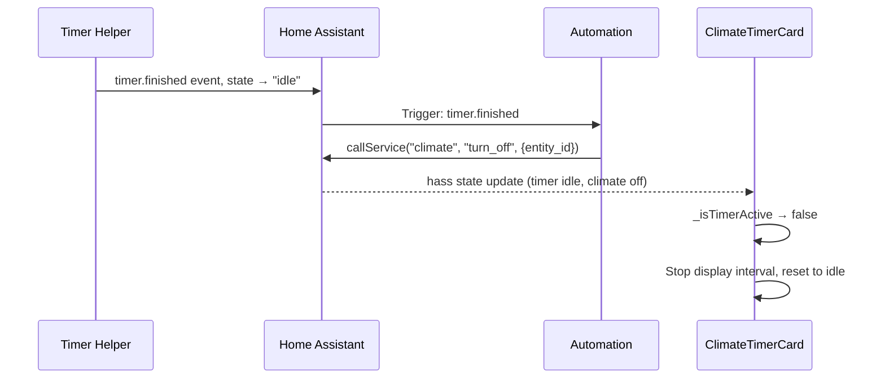

# Design Document: Climate Timer Card

## Overview

The Climate Timer Card is a custom Home Assistant Lovelace card built as a web component using TypeScript and Lit. It provides a scroll-wheel timer interface to run any climate entity for a user-specified duration, automatically turning the entity on at timer start and off when the countdown reaches zero.

The card uses a **hybrid timer architecture**: the actual countdown lives server-side as a Home Assistant Timer helper entity (`timer.*`), while the card provides a real-time animated display by reading the timer entity's `finishes_at` attribute. This means the timer continues running even if the browser tab or entire browser is closed — when the user returns, the card syncs from the server-side timer state.

A companion Home Assistant automation listens for the `timer.finished` event and calls `climate.turn_off`, ensuring reliable shutdown regardless of client connectivity.

**Key Design Decisions:**
- **Lit (LitElement)** for reactive rendering and web component lifecycle management — it's the standard for HA custom cards
- **TypeScript** for type safety and better developer experience with HA type definitions
- **Rollup** for bundling into a single distributable `.js` file
- **Server-side Timer helper** for reliable countdown that survives browser disconnects
- **Client-side display synced from timer entity** for responsive animated UI without managing countdown state locally
- **Companion automation** for guaranteed climate shutdown on timer finish, independent of the card

## Architecture



The architecture follows a clean separation:
1. **Registration layer** (`main.ts`) — registers custom elements and card metadata with HA
2. **Card layer** (`ClimateTimerCard`) — orchestrates UI state, renders the card, and handles HA interactions
3. **Editor layer** (`ClimateTimerCardEditor`) — provides the configuration UI for selecting climate and timer entities
4. **Timer display** (`TimerDisplay`) — reads from the timer helper entity's `finishes_at` attribute to compute and render the animated countdown
5. **Timer selector** (`TimerSelector`) — scroll-wheel input component for duration selection
6. **Server-side timer** (HA Timer helper) — the source of truth for countdown state, persists across browser sessions
7. **Automation** (HA Automation) — listens for `timer.finished` event and calls `climate.turn_off`

### Hybrid Timer Flow



## Components and Interfaces

### 1. `main.ts` — Entry Point & Registration

Registers the custom elements with the browser and declares card metadata for the HA card picker.

```typescript
// Registers:
// - "climate-timer-card" custom element (ClimateTimerCard)
// - "climate-timer-card-editor" custom element (ClimateTimerCardEditor)
// - window.customCards entry for HA card picker
```

### 2. `ClimateTimerCard` (LitElement)

The primary card component. Implements the HA custom card interface.

```typescript
interface ClimateTimerCardConfig {
  type: string;
  entity: string;        // climate.* entity_id
  timer_entity: string;  // timer.* entity_id for the countdown helper
}

class ClimateTimerCard extends LitElement {
  // HA injected properties
  hass: HomeAssistant;
  config: ClimateTimerCardConfig;

  // Internal state
  private _selectedDuration: number; // minutes
  private _errorMessage: string | null;
  private _displayIntervalId: number | null; // for 1s UI refresh

  // HA Custom Card interface
  static getConfigElement(): HTMLElement;
  static getStubConfig(): ClimateTimerCardConfig;
  setConfig(config: ClimateTimerCardConfig): void;
  getCardSize(): number;

  // Computed from timer entity state
  private get _isTimerActive(): boolean;
  private get _timerFinishesAt(): Date | null;
  private get _timerDuration(): number; // total duration in seconds

  // Actions
  private _handleStart(): Promise<void>;
  private _handleCancel(): Promise<void>;
  private _handleDurationChange(e: CustomEvent): void;
  private _handleEntityStateChange(): void;

  // Display sync
  private _startDisplayInterval(): void;
  private _stopDisplayInterval(): void;
  private _computeRemainingMs(): number;
  private _computeElapsedFraction(): number;
}
```

### 3. `ClimateTimerCardEditor` (LitElement)

The visual configuration editor shown in HA's card editor panel.

```typescript
class ClimateTimerCardEditor extends LitElement {
  hass: HomeAssistant;
  private _config: ClimateTimerCardConfig;

  setConfig(config: ClimateTimerCardConfig): void;
  private _entityChanged(e: CustomEvent): void;
  private _timerEntityChanged(e: CustomEvent): void;
  // Fires "config-changed" event to notify HA of config updates
}
```

### 4. `TimerSelector` (LitElement)

A scroll-wheel-like input for selecting timer duration in 5-minute increments.

```typescript
class TimerSelector extends LitElement {
  // Properties
  duration: number;   // current duration in minutes
  disabled: boolean;  // disables interaction during countdown

  // Constants
  static MIN_DURATION = 5;    // minutes
  static MAX_DURATION = 480;  // minutes
  static STEP = 5;            // minutes per scroll step

  // Events
  // Fires "duration-changed" CustomEvent with detail: { duration: number }

  private _handleWheel(e: WheelEvent): void;
  private _handleTouchStart(e: TouchEvent): void;
  private _handleTouchMove(e: TouchEvent): void;
}
```

### Component Interaction Flow — Start



### Component Interaction Flow — Cancel



### Component Interaction Flow — Timer Finishes (Automation)



## Data Models

### Card Configuration (stored in Lovelace YAML)

```yaml
type: custom:climate-timer-card
entity: climate.living_room_ac
timer_entity: timer.climate_living_room_timer
```

```typescript
interface ClimateTimerCardConfig {
  type: string;          // "custom:climate-timer-card"
  entity: string;        // e.g. "climate.living_room_ac"
  timer_entity: string;  // e.g. "timer.climate_living_room_timer"
}
```

### Timer Helper Entity State (from HA)

```typescript
interface TimerEntityState {
  entity_id: string;           // e.g. "timer.climate_living_room_timer"
  state: "idle" | "active" | "paused";
  attributes: {
    duration: string;          // configured default duration "HH:MM:SS"
    remaining: string;         // remaining time "HH:MM:SS" (when paused)
    finishes_at: string;       // ISO timestamp when timer will finish (when active)
    friendly_name: string;
    restore: boolean;
  };
}
```

### Climate Entity State (from HA)

```typescript
interface ClimateEntityState {
  entity_id: string;
  state: string;             // "off" | "heat" | "cool" | "idle" | "dry" | "fan_only" | "unavailable"
  attributes: {
    friendly_name: string;
    hvac_modes: string[];
    temperature: number;
    current_temperature: number;
    fan_mode?: string;
  };
}
```

### Countdown Display State (computed client-side from timer entity)

```typescript
interface CountdownDisplayState {
  isActive: boolean;
  remainingMs: number;       // computed from finishes_at - now()
  totalMs: number;           // computed from duration attribute
  elapsedFraction: number;   // (totalMs - remainingMs) / totalMs, clamped [0, 1]
  formattedRemaining: string; // "MM:SS" format
}
```

### Duration Formatting

| Duration (min) | Display (idle) | Display (countdown) |
|---|---|---|
| 5 | 5m | 05:00 |
| 30 | 30m | 30:00 |
| 60 | 1h 0m | 60:00 |
| 90 | 1h 30m | 90:00 |
| 480 | 8h 0m | 480:00 |

### Utility Functions

```typescript
// Convert minutes to display string for idle state
function formatDurationIdle(minutes: number): string;
// e.g. 5 -> "5m", 60 -> "1h 0m", 90 -> "1h 30m"

// Convert milliseconds to MM:SS display for countdown
function formatCountdown(ms: number): string;
// e.g. 300000 -> "05:00", 61000 -> "01:01"

// Clamp duration within bounds
function clampDuration(minutes: number): number;
// Ensures MIN_DURATION <= result <= MAX_DURATION, snapped to STEP

// Adjust duration by one step in a direction
function adjustDuration(current: number, direction: "up" | "down"): number;
// Returns clamped result after +/- STEP

// Filter entities to climate domain
function filterClimateEntities(entities: Record<string, any>): string[];
// Returns entity_ids starting with "climate."

// Filter entities to timer domain
function filterTimerEntities(entities: Record<string, any>): string[];
// Returns entity_ids starting with "timer."

// Convert minutes to HA timer duration format
function minutesToHADuration(minutes: number): string;
// e.g. 30 -> "00:30:00", 90 -> "01:30:00"

// Compute remaining milliseconds from timer entity finishes_at
function computeRemainingMs(finishesAt: string): number;
// Returns max(0, Date.parse(finishesAt) - Date.now())

// Compute elapsed fraction from timer entity state
function computeElapsedFraction(finishesAt: string, durationStr: string): number;
// totalMs = parse duration, remainingMs = finishesAt - now
// Returns clamp((totalMs - remainingMs) / totalMs, 0, 1)

// Parse HA duration string "HH:MM:SS" to milliseconds
function parseDurationToMs(duration: string): number;
// e.g. "00:30:00" -> 1800000
```

### Companion Automation

The card requires a Home Assistant automation that turns off the climate entity when the timer finishes. This can be set up manually by the user or provided as a blueprint.

```yaml
# Example automation for climate timer card
alias: "Climate Timer - Turn off when timer finishes"
description: "Turns off the climate entity when the associated timer helper finishes"
triggers:
  - trigger: event
    event_type: timer.finished
    event_data:
      entity_id: timer.climate_living_room_timer
actions:
  - action: climate.turn_off
    target:
      entity_id: climate.living_room_ac
mode: single
```

**Documentation Note:** The card's README should include setup instructions for this automation, with guidance on how to match the `timer_entity` in the card config to the automation trigger.

## Correctness Properties

*A property is a characteristic or behavior that should hold true across all valid executions of a system — essentially, a formal statement about what the system should do. Properties serve as the bridge between human-readable specifications and machine-verifiable correctness guarantees.*

### Property 1: Climate entity filtering

*For any* set of Home Assistant entities across arbitrary domains, the filter function SHALL return only entity identifiers that belong to the `climate` domain (i.e., start with "climate."), and SHALL include every climate entity present in the input.

**Validates: Requirements 1.1**

### Property 2: Duration adjustment with clamping

*For any* valid current duration (5 ≤ d ≤ 480, multiple of 5) and any scroll direction (up or down), adjusting the duration SHALL produce a result that is: exactly `d + 5` when direction is up and `d < 480`, exactly `d - 5` when direction is down and `d > 5`, or unchanged when at the respective boundary. The result SHALL always satisfy `5 ≤ result ≤ 480` and be a multiple of 5.

**Validates: Requirements 2.2, 2.3, 2.4, 2.5, 2.6, 2.7**

### Property 3: Idle duration formatting

*For any* valid duration in minutes (5 ≤ m ≤ 480, multiple of 5), the idle format function SHALL produce a string that omits hours when m < 60 (format: "{m}m") and includes hours when m ≥ 60 (format: "{h}h {r}m" where h = floor(m/60) and r = m mod 60).

**Validates: Requirements 2.8**

### Property 4: Countdown time formatting

*For any* remaining time in milliseconds (0 ≤ ms ≤ 480 × 60 × 1000), the countdown format function SHALL produce a string in "MM:SS" format where MM is zero-padded total minutes and SS is zero-padded seconds, and parsing the output back to milliseconds (at second precision) SHALL equal `floor(ms / 1000) * 1000`.

**Validates: Requirements 4.1**

### Property 5: Elapsed fraction computation from timer entity

*For any* `finishes_at` timestamp (in the future or past relative to now) and `duration` string representing a valid HA timer duration, the elapsed fraction function SHALL report a value in [0.0, 1.0] where: the fraction equals `(totalMs - remainingMs) / totalMs`, `remainingMs = max(0, finishesAt - now)`, `totalMs = parseDuration(duration)`, and the result is clamped to [0.0, 1.0]. The remaining time SHALL never be negative.

**Validates: Requirements 4.3, 4.5**

## Error Handling

### Service Call Failures

| Scenario | Behavior |
|---|---|
| `climate.turn_on` fails on start | Timer helper is NOT started. Start button remains enabled. Error message displayed. |
| `timer.start` fails after climate.turn_on succeeds | Card calls `climate.turn_off` to roll back. Start button remains enabled. Error message displayed. |
| `timer.cancel` fails on manual cancel | Card still attempts `climate.turn_off`. Card resets to idle. Error indicator shown for 5 seconds. |
| `climate.turn_off` fails on manual cancel | Card resets to idle state regardless. Error indicator shown for 5 seconds then auto-dismissed. |
| Automation's `climate.turn_off` fails on timer finish | Card observes timer entity going idle and resets UI. Climate entity may still be on — user sees actual climate state displayed. |

**Implementation**: All service calls use try/catch around `this.hass.callService()`. The start flow is sequential: climate.turn_on first, then timer.start. If timer.start fails, the card rolls back by calling climate.turn_off.

### Entity Unavailability

| Scenario | Behavior |
|---|---|
| Climate entity unavailable while idle | Start button disabled. Unavailable indicator displayed. Timer selector remains interactive. |
| Climate entity unavailable during countdown | Timer helper continues running (server-side). Card displays unavailable indicator. When timer finishes, automation may fail to turn off climate. |
| Timer entity unavailable while idle | Start button disabled. Error message: "Timer helper unavailable." |
| Timer entity unavailable during countdown | Card cannot read finishes_at. Displays last known remaining time with a stale indicator. |
| Climate entity turned off externally during countdown | Card cancels timer helper (`timer.cancel`). Resets to idle. No error shown. |

**Implementation**: The `hass` property setter triggers on every state update. The card checks both `this.hass.states[config.entity]` and `this.hass.states[config.timer_entity]` for state changes and unavailability on each render cycle.

### Configuration Errors

| Scenario | Behavior |
|---|---|
| No entity configured | Card body replaced with setup prompt: "Select a climate entity and timer helper to configure this card." |
| No timer_entity configured | Card body replaced with setup prompt: "Select a timer helper entity to configure this card." |
| Entity not in climate domain | Editor shows validation error. Card shows configuration error. |
| Timer entity not in timer domain | Editor shows validation error. Card shows configuration error. |
| Entity does not exist | Editor shows validation error. Card treats as unavailable. |
| Timer entity does not exist | Editor shows validation error. Card shows timer unavailable. |

## Testing Strategy

### Technology Stack

- **Test Framework**: Vitest (fast, TypeScript-native, compatible with Lit testing)
- **Property-Based Testing**: fast-check (TypeScript PBT library)
- **Component Testing**: @open-wc/testing + @lit-labs/testing for web component rendering
- **Mocking**: Vitest built-in mocks for `hass` object and service calls

### Unit Tests (Example-Based)

Unit tests cover specific scenarios, integration points, and edge cases:

- **Card Configuration**: setConfig accepts valid config with entity + timer_entity, rejects invalid, shows setup message when either is empty
- **Start Flow**: calls climate.turn_on then timer.start, handles climate.turn_on failure (no timer.start), handles timer.start failure (rolls back with climate.turn_off)
- **Cancel Flow**: calls timer.cancel and climate.turn_off, resets state
- **Timer Entity State Sync**: card reads finishes_at when timer active, displays idle when timer idle, handles timer entity going unavailable
- **Completion Flow (via automation)**: card observes timer entity idle + climate off, resets UI
- **Entity State**: displays current climate state, handles climate unavailable, handles external off
- **UI State Transitions**: button visibility, selector disabled/enabled states
- **Editor**: shows both entity and timer_entity dropdowns, filters correctly, fires config-changed
- **Duration Conversion**: minutesToHADuration produces valid HA duration strings
- **Layout**: DOM order verification, element presence

### Property-Based Tests

Property tests validate universal correctness across generated inputs. Each test runs minimum 100 iterations using fast-check.

| Property | What's Generated | What's Verified |
|---|---|---|
| 1: Entity filtering | Random entity maps with mixed domains | Only climate.* returned; all climate.* included |
| 2: Duration adjustment | Random durations [5..480] × direction | Result in bounds, correct delta, multiple of 5 |
| 3: Idle formatting | Random durations [5..480] step 5 | Format matches "Xh Ym" or "Ym" rule |
| 4: Countdown formatting | Random ms [0..28800000] | Output is "MM:SS", round-trip at second precision |
| 5: Elapsed fraction | Random (finishesAt, duration, now) tuples | Fraction in [0,1], matches formula, remaining ≥ 0 |

Each property test is tagged with:
```
// Feature: climate-timer-card, Property {N}: {title}
```

### Integration Tests

- **HA Service Interaction**: Mock `hass.callService`, verify correct domain/service/data for climate.turn_on, timer.start, timer.cancel, climate.turn_off
- **Timer Entity Subscription**: Verify card re-renders when `hass` property updates with new timer entity state (active/idle transitions)
- **Full Lifecycle**: Start → timer active → tab close simulation → tab reopen (new hass state) → timer finishes → idle
- **Rollback Flow**: climate.turn_on succeeds → timer.start fails → climate.turn_off called
- **Automation Verification**: Validate automation YAML structure triggers on correct timer.finished entity and calls correct climate.turn_off target

### Test File Structure

```
src/
├── __tests__/
│   ├── format-utils.test.ts            # Unit tests for formatting functions
│   ├── format-utils.property.test.ts   # PBT for formatting (Properties 3, 4)
│   ├── entity-utils.test.ts            # Unit tests for entity filtering
│   ├── entity-utils.property.test.ts   # PBT for entity filtering (Property 1)
│   ├── duration-utils.test.ts          # Unit tests for duration adjustment + HA conversion
│   ├── duration-utils.property.test.ts # PBT for duration adjustment (Property 2)
│   ├── timer-display.test.ts           # Unit tests for countdown display sync
│   ├── timer-display.property.test.ts  # PBT for elapsed fraction (Property 5)
│   ├── timer-selector.test.ts          # Unit tests for scroll-wheel component
│   ├── climate-timer-card.test.ts      # Integration tests for main card
│   └── editor.test.ts                  # Unit tests for editor component
```
