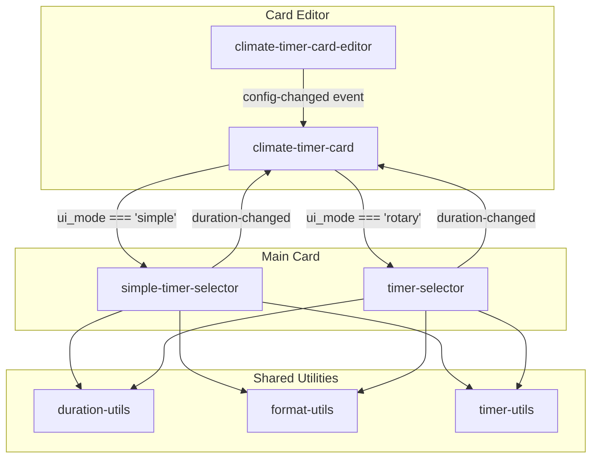

# Design Document: UI Mode Selection

## Overview

This feature extends the Climate Timer Card with a configurable UI mode that lets users choose between the existing **Rotary UI** (dial-based timer selector) and a new **Simple UI** (button-based ±  controls). The design adds:

1. A `ui_mode` configuration property (`"rotary"` | `"simple"`) with `"rotary"` as the default.
2. A new `<simple-timer-selector>` LitElement web component implementing the button-based interface.
3. An extended card editor with a mode selection dropdown.
4. Conditional rendering in the main card component to switch between selector components based on configuration.

The implementation reuses existing utility functions (`adjustDuration`, `clampDuration`, `formatDurationIdle`, `formatCountdown`) and follows the established event contract (`duration-changed` CustomEvent with `{ duration: number }`, `bubbles: true`, `composed: true`).

## Architecture



**Key Architectural Decisions:**

1. **New component vs. refactoring existing**: A separate `<simple-timer-selector>` component keeps the rotary and simple UIs decoupled. The rotary selector has complex drag/touch/wheel gesture handling that would be cluttered by conditional button logic. Separate components allow independent styling and testing.

2. **Same event contract**: Both selectors fire the same `duration-changed` CustomEvent shape, making them drop-in replaceable from the parent card's perspective.

3. **Utility reuse**: The Simple UI reuses `adjustDuration`, `clampDuration`, `formatDurationIdle`, `formatCountdown`, and `computeRemainingMs` without modification. No new utility functions are needed.

4. **Mode resolution in the card**: The `climate-timer-card` resolves `ui_mode` at render time with a fallback to `"rotary"` for missing or invalid values. This keeps validation logic centralized.

## Components and Interfaces

### Modified: `ClimateTimerCardConfig` (src/types.ts)

```typescript
export interface ClimateTimerCardConfig {
  type: string;
  entity: string;
  timer_entity: string;
  max_duration?: string;
  step?: string;
  show_name?: boolean;
  show_state?: boolean;
  ui_mode?: "rotary" | "simple"; // NEW — defaults to "rotary"
}
```

### New: `<simple-timer-selector>` (src/components/simple-timer-selector.ts)

A LitElement component that renders a horizontal row of `[−] [duration] [+]` controls.

**Properties (reactive):**

| Property | Type | Default | Description |
|----------|------|---------|-------------|
| `duration` | `number` | `30` | Current duration in minutes |
| `disabled` | `boolean` | `false` | Disables buttons (active countdown) |
| `maxDuration` | `number` | `240` | Maximum allowed duration |
| `stepSize` | `number` | `15` | Increment/decrement step |
| `finishesAt` | `string \| null` | `null` | ISO timestamp for countdown |
| `durationStr` | `string` | `"00:30:00"` | Total timer duration HH:MM:SS |
| `timerActive` | `boolean` | `false` | Whether timer is counting down |

**Events fired:**
- `duration-changed`: `CustomEvent<{ duration: number }>` — bubbles, composed

**Rendering modes:**
- **Idle**: `[−] formatDurationIdle(duration) [+]` with buttons enabled/disabled based on boundary
- **Active**: `[−] formatCountdown(remainingMs) [+]` with both buttons disabled

### Modified: `<climate-timer-card>` (src/components/climate-timer-card.ts)

- Adds `ui_mode` resolution logic: `const mode = (this._config.ui_mode === "simple") ? "simple" : "rotary"`
- Conditionally renders `<timer-selector>` or `<simple-timer-selector>` based on resolved mode
- Both receive the same props: `duration`, `disabled`, `maxDuration`, `stepSize`, `finishesAt`, `durationStr`, `timerActive`

### Modified: `<climate-timer-card-editor>` (src/components/climate-timer-card-editor.ts)

- Adds a `<select>` control for `ui_mode` with options "Rotary" (`rotary`) and "Simple" (`simple`)
- Defaults the selected value to `"rotary"` when `ui_mode` is undefined in config
- Fires `config-changed` with the full config including the new `ui_mode` value

## Data Models

### Configuration Schema (Lovelace YAML)

```yaml
type: custom:climate-timer-card
entity: climate.living_room_ac
timer_entity: timer.climate_living_room_timer
ui_mode: simple          # NEW - "rotary" (default) or "simple"
max_duration: 4h
step: 15m
show_name: true
show_state: true
```

### UI Mode Resolution Logic

```typescript
function resolveUiMode(config: ClimateTimerCardConfig): "rotary" | "simple" {
  if (config.ui_mode === "simple") return "simple";
  return "rotary"; // default for missing, undefined, or invalid values
}
```

### Duration State Model

The duration state remains unchanged. Both UI modes operate on the same state:

```typescript
interface DurationState {
  selectedDuration: number;  // in minutes, multiple of step, range [step, maxDuration]
  step: number;              // from config, default 15
  maxDuration: number;       // from config, default 240
}
```

**Invariants:**
- `selectedDuration` is always a positive multiple of `step`
- `step <= selectedDuration <= maxDuration`
- On mode switch, if `selectedDuration` violates these invariants with the current config, it is rounded to the nearest valid value via `clampDuration()`

### Event Detail Contract

Both selectors emit:
```typescript
new CustomEvent("duration-changed", {
  detail: { duration: number }, // duration in minutes
  bubbles: true,
  composed: true,
})
```

## Correctness Properties

*A property is a characteristic or behavior that should hold true across all valid executions of a system — essentially, a formal statement about what the system should do. Properties serve as the bridge between human-readable specifications and machine-verifiable correctness guarantees.*

### Property 1: UI Mode Resolution Always Produces Valid Mode

*For any* string value assigned to the `ui_mode` configuration property (including `undefined`, `null`, empty string, or arbitrary strings), the resolved UI mode SHALL always be either `"rotary"` or `"simple"`, and SHALL be `"rotary"` for any value other than `"simple"`.

**Validates: Requirements 1.1, 1.2, 1.3**

### Property 2: Duration Adjustment Correctness

*For any* valid duration `d` (where `step <= d <= maxDuration` and `d` is a multiple of `step`), any valid `step > 0`, any valid `maxDuration >= step`, and any direction (`"up"` or `"down"`), the result of `adjustDuration(d, direction, maxDuration, step)` SHALL be a multiple of `step` within the range `[step, maxDuration]`.

**Validates: Requirements 3.3, 3.4, 3.7, 3.8**

### Property 3: Duration Boundary Clamping Invariant

*For any* non-negative integer duration, any valid `step > 0`, and any valid `maxDuration >= step`, `clampDuration(duration, maxDuration, step)` SHALL produce a value that is (a) a positive multiple of `step`, (b) greater than or equal to `step`, and (c) less than or equal to `maxDuration`.

**Validates: Requirements 3.5, 3.6, 3.7, 3.8, 7.2**

### Property 4: Idle Duration Format Correctness

*For any* positive integer duration in minutes, `formatDurationIdle(duration)` SHALL produce a string matching the pattern `"{m}m"` when duration < 60, or `"{h}h {r}m"` when duration >= 60, where `h = floor(duration / 60)` and `r = duration % 60`.

**Validates: Requirements 3.2**

### Property 5: Countdown Format Correctness

*For any* non-negative integer millisecond value, `formatCountdown(ms)` SHALL produce a string in "MM:SS" format where MM is zero-padded to at least 2 digits and SS is zero-padded to exactly 2 digits, and the numeric values satisfy `MM = floor(floor(ms/1000) / 60)` and `SS = floor(ms/1000) % 60`.

**Validates: Requirements 4.4**

### Property 6: Event Contract Consistency

*For any* duration change triggered in the Simple UI (via increment or decrement button), the emitted `duration-changed` CustomEvent SHALL have `detail.duration` set to a number (the new duration in minutes), `bubbles` set to `true`, and `composed` set to `true`, matching the Rotary UI event contract exactly.

**Validates: Requirements 7.1**

### Property 7: Duration Preservation on Mode Switch

*For any* current duration and any new configuration (step, maxDuration), switching `ui_mode` SHALL result in a duration equal to `clampDuration(currentDuration, maxDuration, step)` — which is the nearest valid multiple of `step` that does not exceed `maxDuration`, with a minimum value of `step`.

**Validates: Requirements 7.3, 7.4**

### Property 8: Editor Config-Changed Event Completeness

*For any* valid card configuration and any UI mode selection change in the editor, the fired `config-changed` CustomEvent's `detail.config` object SHALL contain all existing configuration properties plus `ui_mode` set to the selected value, with `bubbles: true` and `composed: true`.

**Validates: Requirements 2.2**

## Error Handling

| Scenario | Handling |
|----------|----------|
| `ui_mode` is invalid/missing | Resolve to `"rotary"` silently — no error shown to user |
| `step` or `max_duration` is invalid in config | Existing `validateDurationConfig()` shows error in editor; card uses defaults |
| Timer entity unavailable during simple UI active state | Both buttons already disabled (active state); display shows "00:00" when timer finishes |
| `finishesAt` is null during active state | Simple UI shows idle layout (defensive fallback) |
| Duration outside valid range after config change | `clampDuration()` normalizes to nearest valid value |

No new error handling patterns are introduced. The Simple UI follows the same defensive patterns as the existing Rotary UI.

## Testing Strategy

### Property-Based Tests (fast-check, minimum 100 iterations each)

The following properties will be implemented using `fast-check` (already in devDependencies):

1. **UI mode resolution** — Generate arbitrary strings and verify resolved mode is always valid
2. **Duration adjustment** — Generate valid (duration, step, maxDuration, direction) tuples and verify post-conditions
3. **Clamping invariant** — Generate arbitrary (duration, step, maxDuration) and verify result is always valid
4. **Idle format** — Generate durations 1–1440, verify format pattern
5. **Countdown format** — Generate ms values 0–86400000, verify MM:SS pattern
6. **Event contract** — Generate random interactions, verify event shape
7. **Mode switch preservation** — Generate (duration, step, maxDuration) tuples, verify clamping result
8. **Editor event completeness** — Generate valid configs, simulate change, verify event content

Each property test will be tagged with:
```
// Feature: ui-mode-selection, Property N: {property_text}
```

Minimum 100 iterations per property (fast-check default is 100).

### Unit Tests (vitest)

Example-based tests for:
- Editor renders exactly two options ("Rotary", "Simple")
- Card renders `<timer-selector>` when mode is "rotary"
- Card renders `<simple-timer-selector>` when mode is "simple"
- Default selection in editor when `ui_mode` is undefined
- Simple UI layout order (decrement, display, increment)
- Buttons disabled during active countdown
- Accessible labels on buttons
- `aria-disabled` attribute on disabled buttons
- `aria-live` region updates on duration change
- CSS-only HA custom properties used (static analysis or snapshot)

### Integration Tests

- Keyboard navigation (Tab to buttons, Enter/Space activation)
- Timer interval updates display every ~1s during active state

### Test File Locations

- Property tests: `src/__tests__/simple-timer-selector.property.test.ts`
- Unit tests: `src/__tests__/simple-timer-selector.test.ts`
- Editor tests: `src/__tests__/editor.test.ts` (extend existing)
- Card rendering tests: `src/__tests__/climate-timer-card.test.ts` (extend existing)
