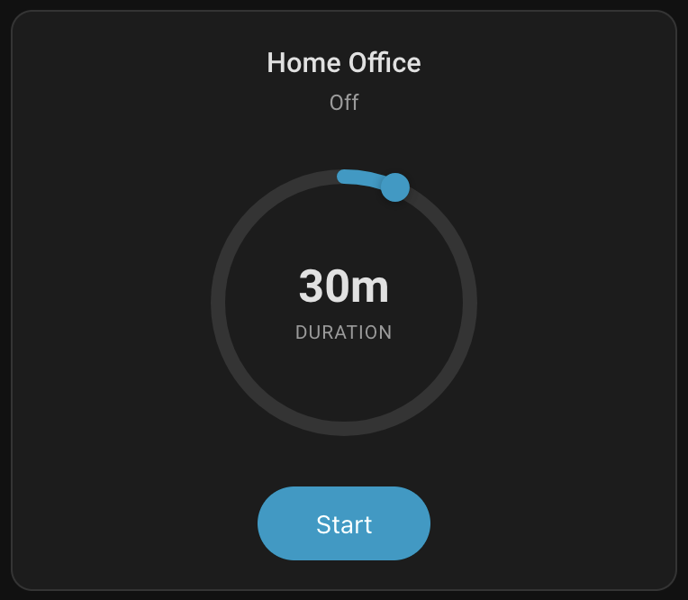
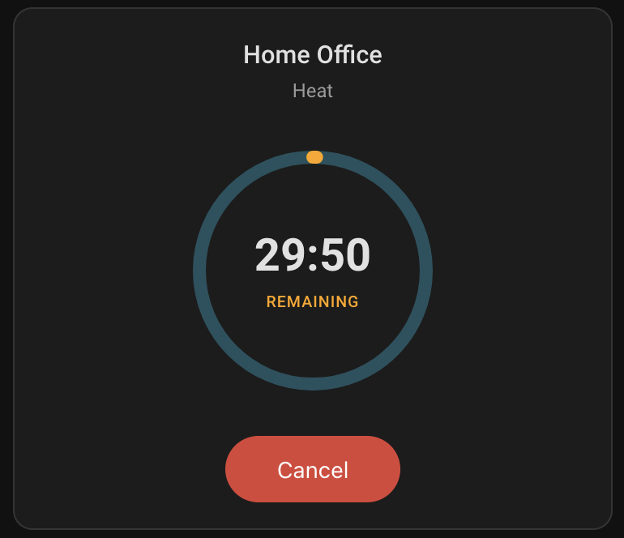
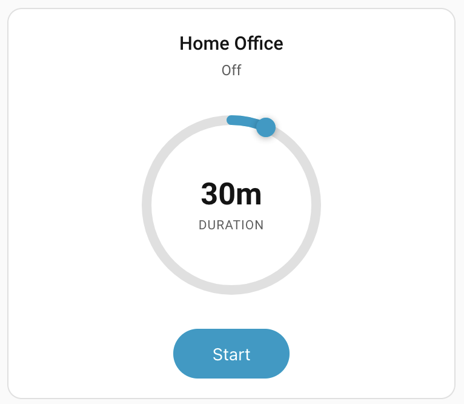
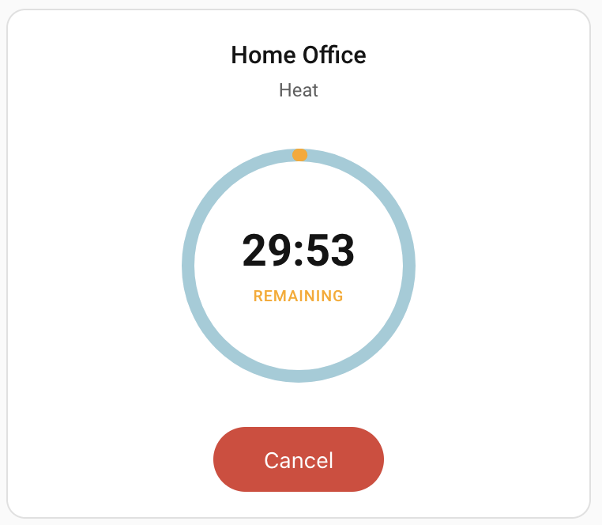

# Climate Timer Card

[](https://github.com/hatools93/climate-timer/actions/workflows/validate.yml)
[](https://github.com/hatools93/climate-timer/actions/workflows/release.yml)


A custom Home Assistant Lovelace card that runs any climate entity for a specified duration using a rotary dial interface. When the timer expires, the climate entity is automatically turned off.

## Screenshots
### Dark Theme
| Timer Set | Timer Start State |
|---|---|
|  |  |

### Light Theme
| Timer Set | Timer Start State |
|---|---|
|  |  |

## Features

- **Rotary dial UI** — drag, scroll, or swipe to set timer duration
- **Real-time countdown** — animated elapsed arc with MM:SS display inside the dial
- **Reliable shutdown** — uses a server-side HA Timer helper so the countdown survives browser disconnects
- **Configurable** — max duration, step size, show/hide name and state
- **Rollback on failure** — if the timer fails to start, the climate entity is turned back off
- **External change awareness** — detects if the climate entity is turned off externally and cancels the timer
- **Layout support** — works with HA grid resizing

## Prerequisites

1. A **climate entity** (e.g., `climate.living_room_ac`)
2. A **Timer helper** — create one in Settings → Devices & Services → Helpers → Add → Timer
3. A **companion automation** to turn off the climate when the timer finishes (blueprint provided)

## Installation

### HACS (Recommended)

[](https://my.home-assistant.io/redirect/hacs_repository/?owner=hatools93&repo=climate-timer&category=plugin)

1. Click the button above, or go to **HACS → Frontend → Explore & Download Repositories** and search for "Climate Timer Card"
2. Download the card
3. Restart Home Assistant

### Manual

#### 1. Install the card

Copy `dist/climate-timer-card.js` to your Home Assistant `config/www/` directory:

```
config/www/climate-timer/climate-timer-card.js
```

#### 2. Add as a resource

Go to **Settings → Dashboards → Resources** (or add to your YAML config):

```yaml
resources:
  - url: /local/climate-timer/climate-timer-card.js
    type: module
```

### 3. Install the companion automation

Copy `automation/climate-timer-blueprint.yaml` to:

```
config/blueprints/automation/climate-timer/climate-timer-blueprint.yaml
```

Then go to **Settings → Automations → Blueprints**, reload, and create an automation from the blueprint. Select your timer helper and climate entity.

### 4. Add the card to your dashboard

Add a new card and search for "Climate Timer Card" in the card picker, or add via YAML:

```yaml
type: custom:climate-timer-card
entity: climate.living_room_ac
timer_entity: timer.climate_living_room_timer
```

## Configuration

| Option | Type | Default | Description |
|--------|------|---------|-------------|
| `entity` | string | *required* | Climate entity ID |
| `timer_entity` | string | *required* | Timer helper entity ID |
| `max_duration` | string | `"4h"` | Maximum timer duration (e.g., "4h", "240m", "2h30m") |
| `step` | string | `"15m"` | Duration step size (e.g., "15m", "30m", "1h") |
| `show_name` | boolean | `true` | Show entity friendly name |
| `show_state` | boolean | `true` | Show climate entity state |

### Full example

```yaml
type: custom:climate-timer-card
entity: climate.bedroom_ac
timer_entity: timer.bedroom_climate_timer
max_duration: "2h"
step: "15m"
show_name: true
show_state: false
```

## How It Works

1. **Select duration** — Drag the rotary dial or scroll to choose how long the climate should run
2. **Press Start** — The card calls `climate.turn_on`, then starts the Timer helper with the selected duration
3. **Countdown** — The dial shows an orange arc growing clockwise with remaining time in the center, updating every second
4. **Auto-off** — When the timer finishes, the companion automation calls `climate.turn_off`
5. **Cancel** — Press Cancel at any time to stop the timer and turn off the climate entity

The timer runs server-side, so even if you close the browser, the climate entity will be turned off when time's up.

## Development

### Build

```bash
npm install
npm run build
```

Output: `dist/climate-timer-card.js`

### Test

```bash
npm run test:run
```

### Watch mode (development)

```bash
npm run test
```

## Tech Stack

- **TypeScript** + **Lit** (LitElement)
- **Rollup** (ES module bundle)
- **Vitest** + **fast-check** (property-based testing)

## License

MIT
