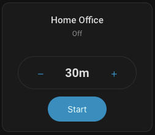
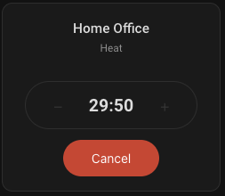
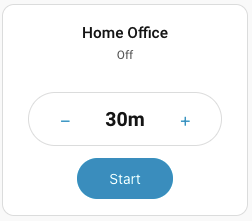
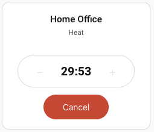

# Climate Timer Card

[](https://github.com/hatools93/climate-timer/actions/workflows/validate.yml)
[](https://github.com/hatools93/climate-timer/actions/workflows/release.yml)


A custom Home Assistant Lovelace card that runs any climate entity for a specified duration. Choose between a rotary dial or a simple button-based interface. When the timer expires, the climate entity is automatically turned off.

> **Looking for less manual setup?** There is also a [Climate Timer Integration](https://github.com/hatools93/climate-timer-integration) available. The integration version handles timer helpers and automations for you automatically, so you don't need to create and configure them yourself. It also provides built-in logging and fires Home Assistant events for timer start/stop/finish, making it easier to build further automations and track usage. If you'd prefer a simpler setup with fewer manual steps, check it out.

## Screenshots
### Dark Theme
| Timer Set | Timer Start State |
|---|---|
|  |  |

### Light Theme
| Timer Set | Timer Start State |
|---|---|
|  |  |

### Simple UI Mode
| Timer Set | Timer Start State |
|---|---|
| <!-- TODO: Add simple UI dark screenshot -->  | <!-- TODO: Add simple UI countdown screenshot -->  |

| Timer Set (Light) | Timer Start State (Light) |
|---|---|
| <!-- TODO: Add simple UI light screenshot -->  | <!-- TODO: Add simple UI light countdown screenshot -->  |

## Features

- **Rotary dial UI** — drag, scroll, or swipe to set timer duration
- **Simple UI mode** — clean capsule-shaped button interface with [−] duration [+] controls
- **Real-time countdown** — animated elapsed arc with MM:SS display inside the dial
- **Reliable shutdown** — uses a server-side HA Timer helper so the countdown survives browser disconnects
- **Configurable** — max duration, step size, show/hide name and state
- **Rollback on failure** — if the timer fails to start, the climate entity is turned back off
- **External change awareness** — detects if the climate entity is turned off externally and cancels the timer
- **Layout support** — works with HA grid resizing

## Prerequisites

1. A **climate entity** (e.g., `climate.living_room_ac`)
2. A **Timer helper** — create one in Settings → Devices & Services → Helpers → Add → Timer
3. A **companion automation** to turn off the climate when the timer finishes (blueprint provided)

## Installation

### HACS (Recommended)

[](https://my.home-assistant.io/redirect/hacs_repository/?owner=hatools93&repo=climate-timer&category=plugin)

1. Click the button above, or go to **HACS → Frontend → Explore & Download Repositories** and search for "Climate Timer Card"
2. Download the card
3. Restart Home Assistant

### Manual

#### 1. Install the card

Copy `dist/climate-timer-card.js` to your Home Assistant `config/www/` directory:

```
config/www/climate-timer/climate-timer-card.js
```

#### 2. Add as a resource

Go to **Settings → Dashboards → Resources** (or add to your YAML config):

```yaml
resources:
  - url: /local/climate-timer/climate-timer-card.js
    type: module
```

### 3. Install the companion automation

Copy `automation/climate-timer-blueprint.yaml` to:

```
config/blueprints/automation/climate-timer/climate-timer-blueprint.yaml
```

Then go to **Settings → Automations → Blueprints**, reload, and create an automation from the blueprint. Select your timer helper and climate entity.

### 4. Add the card to your dashboard

Add a new card and search for "Climate Timer Card" in the card picker, or add via YAML:

```yaml
type: custom:climate-timer-card
entity: climate.living_room_ac
timer_entity: timer.climate_living_room_timer
```

## Configuration

| Option | Type | Default | Description |
|--------|------|---------|-------------|
| `entity` | string | *required* | Climate entity ID |
| `timer_entity` | string | *required* | Timer helper entity ID |
| `max_duration` | string | `"4h"` | Maximum timer duration (e.g., "4h", "240m", "2h30m") |
| `step` | string | `"15m"` | Duration step size (e.g., "15m", "30m", "1h") |
| `show_name` | boolean | `true` | Show entity friendly name |
| `show_state` | boolean | `true` | Show climate entity state |
| `ui_mode` | string | `"rotary"` | UI style: `"rotary"` (dial) or `"simple"` (buttons) |
| `mode_helper` | string | *optional* | Input select helper for HVAC mode persistence (e.g., `"input_select.ac_last_mode"`) |

### Full example

```yaml
type: custom:climate-timer-card
entity: climate.bedroom_ac
timer_entity: timer.bedroom_climate_timer
max_duration: "2h"
step: "15m"
show_name: true
show_state: false
ui_mode: simple
# mode_helper: input_select.bedroom_ac_mode  # Optional: for HVAC mode persistence
```

### Simple UI mode example

```yaml
type: custom:climate-timer-card
entity: climate.living_room_ac
timer_entity: timer.climate_living_room_timer
ui_mode: simple
```

The simple mode uses [−] and [+] buttons inside a capsule-shaped control. It works well for smaller card sizes or users who prefer a compact interface.

## HVAC Mode Restoration

When you press **Start** and the climate entity is currently off, the card needs to decide which HVAC mode to use when turning it back on. The card resolves the mode using the following priority order:

### Resolution Order

1. **Entity attributes** (most reliable) — The card reads `last_mode` or `hvac_mode` from the climate entity's attributes. Most climate integrations persist these attributes even when the entity is off, so this works automatically without any extra configuration.

2. **Mode helper** (optional, for cross-device sync) — If configured, the card reads the state of an `input_select` helper entity. This is useful when your climate integration does NOT expose `last_mode`/`hvac_mode` attributes when off.

3. **Home Assistant default** — If no mode can be resolved from either source, the card calls `climate.turn_on` without specifying a mode, letting Home Assistant decide the default.

### When Do You Need a Mode Helper?

Most users **don't need** to configure `mode_helper`. It's only necessary if:

- Your climate integration doesn't persist HVAC mode in entity attributes when the entity is off
- You want mode persistence across multiple devices or dashboards (the helper is shared server-side state)
- You've noticed the card always starts in the wrong mode after a browser reload

### Setting Up a Mode Helper

1. Go to **Settings → Devices & Services → Helpers → Add → Dropdown**
2. Name it something like "AC Last Mode"
3. Add your HVAC modes as options (e.g., `heat`, `cool`, `dry`, `fan_only`, `auto`)
4. Add it to your card configuration:

```yaml
type: custom:climate-timer-card
entity: climate.living_room_ac
timer_entity: timer.climate_living_room_timer
mode_helper: input_select.ac_last_mode
```

When configured, the card automatically keeps the helper in sync — whenever the climate entity changes to an active mode, the helper is updated. On the next start, if entity attributes aren't available, the card reads from this helper.

## How It Works

1. **Select duration** — Drag the rotary dial (rotary mode) or tap [−]/[+] buttons (simple mode) to choose how long the climate should run
2. **Press Start** — If the climate is off, the card restores the last-known HVAC mode (see [HVAC Mode Restoration](#hvac-mode-restoration)), then starts the Timer helper with the selected duration. If the climate is already on, it just starts the timer without changing the mode.
3. **Countdown** — The dial shows an orange arc growing clockwise with remaining time in the center, updating every second
4. **Auto-off** — When the timer finishes, the companion automation calls `climate.turn_off`
5. **Cancel** — Press Cancel at any time to stop the timer and turn off the climate entity

The timer runs server-side, so even if you close the browser, the climate entity will be turned off when time's up.

## Development

### Build

```bash
npm install
npm run build
```

Output: `dist/climate-timer-card.js`

### Test

```bash
npm run test:run
```

### Watch mode (development)

```bash
npm run test
```

## Tech Stack

- **TypeScript** + **Lit** (LitElement)
- **Rollup** (ES module bundle)
- **Vitest** + **fast-check** (property-based testing)

## License

MIT
